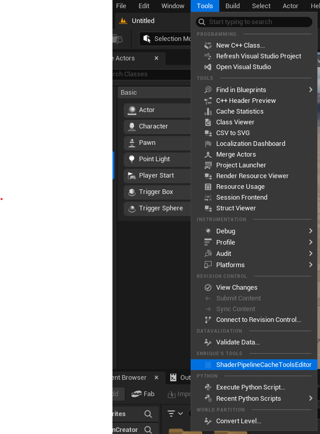
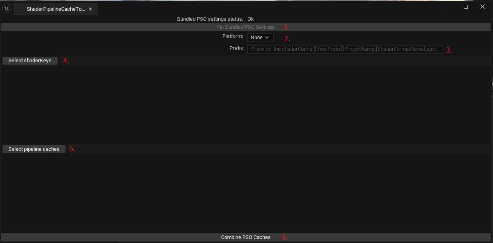

# ShaderPipelineCacheToolsEditor

## Why 
At Cyborn, we already had an external tool that combined PSO (Pipeline State Object) caches by calling the Unreal Engine command line. However, it was hardcoded for the shader format SF_VULKAN_ES31_ANDROID, limiting its usefulness. After a conversation with my lead developer, we agreed that this functionality would be more effective as an in-editor tool — one that supported multiple formats and was accessible directly in Unreal. Unfortunately, I didn’t have time to implement it during work hours, so I took the initiative to create it in my own time as a personal project.

## What
The **ShaderPipelineCacheToolsEdito**r is a lightweight Unreal Engine plugin that provides a user-friendly GUI to bundle PSO caches. Its goal is to make cache generation more accessible for artists and developers without needing to use external tools or scripts.

### Key Features:
- **GUI interface inside Unreal Editor** to create bundled PSO caches.
- **File pickers** to select .rec.upipelinecache and .shk (shader key) files.
- **Validation** of selected files to prevent runtime errors.
- **Command-line execution** of the Unreal Editor to generate the final .spc cache:
    
    ```
    Engine\Binaries\Win64\UnrealEditor-Cmd.exe [ProjectName] -run=ShaderPipelineCacheTools expand C:\PSOCache\*.rec.upipelinecache C:\PSOCache\*.shk C:\PSOCache\[YourPrefix][ProjectName][ShaderFormatName].spc 
    ```
- **Built-in validation** to check and assist in configuring the project correctly for PSO caching.
- **Supports multiple shader formats**, not just Android Vulkan, making it more flexible than our original tool.

## Instalation Instructions
Clone this repository in your project plugins folder 

``` git clone https://github.com/EnriqueBrosse/ShaderPipelineCacheToolsEditor.git```

## How to Use ShaderPipelineCacheToolsEditor

The tool can be found in the Unreal Editor under:
**Tools → Enrique's Tools → ShaderPipelineCacheToolsEditor**



### Step-by-Step Instructions:
1. **Fix Bundled PSO Settings**

    Automatically sets or corrects the required project settings for using bundled PSO caches.
2. **Select Platform**
    
    Choose the target platform (e.g., Android, Windows) for which you want to combine PSO caches.
3. **Set Cache Prefix**

    Define a prefix that will be used when generating the final .spc file.
    
    ```Format: [YourPrefix][ProjectName][ShaderFormatName].spc```
4. **Select Shader Keys**

    Opens a folder picker to select all relevant .shk (stable shader key) files.
5. **Select Pipeline Caches**
    
    Opens a folder picker to select all .rec.upipelinecache files.
6. **Combine PSO Caches**
    
    Executes the Unreal command line with the provided inputs:

    ```
    Engine\Binaries\Win64\UnrealEditor-Cmd.exe [ProjectName] -run=ShaderPipelineCacheTools expand C:\PSOCache\*.rec.upipelinecache C:\PSOCache\*.shk C:\PSOCache\[YourPrefix][ProjectName][ShaderFormatName].spc
    ```

    The generated cache will be saved in:
    
    ```Build/{Platform}/PipelineCaches/```


